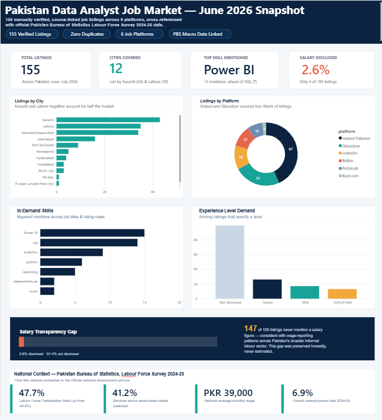

# Pakistan Data Analyst Job Market — 2026 Snapshot Analysis

[]()
[]()
[]()
[]()
[]()

A data analysis project examining Pakistan's Data Analyst / IT job market through **155 manually verified, source-linked job listings** collected from six job platforms, cross-referenced with **official Pakistan Bureau of Statistics (PBS) Labour Force Survey 2024-25** data.

**[Power BI Dashboard →](./dashboard/Pakistan%20Data%20Analyst%20Job%20Market_Dashboard.pbix)** &nbsp;·&nbsp; **[SQL Queries →](./sql/queries.sql)** &nbsp;·&nbsp; **[Full Written Report →](./report/Project_Report.md)** &nbsp;·&nbsp; **[Excel Workbook →](./analysis/Pakistan_Data_Analyst_Job_Market_Analysis.xlsx)**



---

## Why this project is different

Most beginner "job market analysis" portfolios use synthetic or scraped-and-unverified data. This one doesn't:

- **Every row traces to a real, live `source_url`.** Nothing was scraped by an automated crawler — each listing was manually verified via live search across Indeed Pakistan, Glassdoor, LinkedIn, BeBee, Rozee.pk, and Bayt.com.
- **Undisclosed fields were never estimated.** 151 of 155 listings don't disclose a salary figure — and that gap was preserved honestly rather than filled with guessed numbers. That 97.4% non-disclosure rate is itself a finding, benchmarked against PBS wage-transparency patterns.
- **A real data bug was caught and fixed during cleaning**: two listings had USD-denominated pay (one an hourly contract rate) that an early parsing pass mistakenly averaged in with PKR monthly salaries. The final `Cleaned_Data` sheet documents the currency-aware fix.

## What's in this repo

```
├── data/
│   ├── raw/                  Original unprocessed source files + collection methodology
│   └── cleaned/               Cleaned, analysis-ready dataset (20 columns, engineered fields)
├── sql/
│   ├── schema.sql              Table definitions, constraints, indexes
│   ├── create_database.py      Loads cleaned CSV into a SQLite database
│   ├── queries.sql             10 annotated queries: CTEs, window functions, subqueries, views
│   ├── query_outputs.md        Real results of every query
│   └── job_market.db           The database file — open in any SQLite client
├── analysis/
│   └── Pakistan_Data_Analyst_Job_Market_Analysis.xlsx   Full workbook: cleaned data,
│       macro comparison, 5 summary sheets, live formulas, native Excel charts
├── dashboard/
│   └── Pakistan Data Analyst Job Market_Dashboard.pbix   Interactive Power BI dashboard —
│                               open in Power BI Desktop (KPI cards, city/platform/skill charts,
│                               salary transparency view, PBS macro context cards)
├── report/
│   └── Project_Report.md      Full write-up: methodology, findings, macro context, limitations
└── images/
    └── dashboard_preview.png
```

## Key findings

| Metric | Finding |
|---|---|
| Geographic concentration | Karachi (43) + Lahore (35) = 50% of all listings |
| Top platform | Indeed Pakistan (67 listings, 43% of sample) |
| Most in-demand skill | Power BI (13 mentions) ahead of SQL (7) |
| Salary transparency | Only 2.6% of listings disclose an exact figure |
| Experience skew | Among listings that specify a level, Senior (26) > Mid (17) > Entry (13) |
| Macro context | Sample's IT/Services concentration aligns with national services-sector share rising to 41.2% (PBS 2024-25) |

Full breakdown, methodology, and limitations: [`report/Project_Report.md`](./report/Project_Report.md)

## Tools used

`Python (pandas)` for data cleaning · `SQL (SQLite)` for relational analysis — CTEs, window functions, subqueries, views · `openpyxl` for Excel formulas/charts · `Power BI` (DAX measures, interactive visuals) for the dashboard · `Pakistan Bureau of Statistics` official survey data for macro benchmarking

## Data sources

- Rozee.pk, LinkedIn Pakistan, Glassdoor Pakistan, Bayt.com, BeBee, Indeed Pakistan (individual listings, June–July 2026)
- Pakistan Bureau of Statistics — Labour Force Survey 2024-25

## Honest limitations

This is a manually-compiled snapshot (155 listings), not a live production scrape, and reflects listings visible in late June–early July 2026. Full limitations are documented in [`report/Project_Report.md`](./report/Project_Report.md#limitations).

---

*Built as a portfolio data-analysis project. Questions or feedback welcome via issues.*
